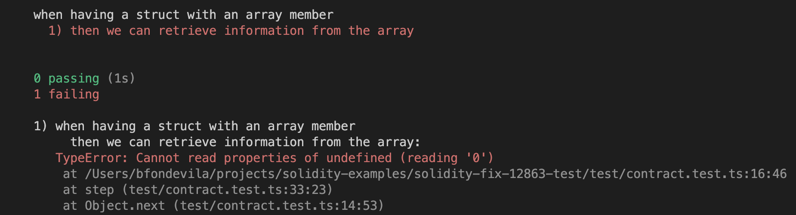
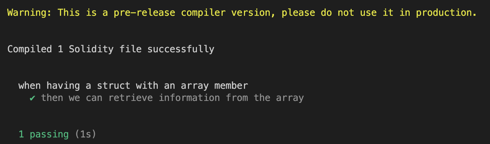

# Solidity - return value for array inside structs

Sample project that fails with the latest version of solidity but works after fixing issue [#12863](https://github.com/ethereum/solidity/issues/12863).

Usage:

* `yarn test` downloads and uses the default solc compiler
* `yarn testFix` uses a local version of solc (specify path in hardhat.config.ts, by default is the current dir solc)

Expected behaviour with current solidity compiler:

Applying fix to #12863:

